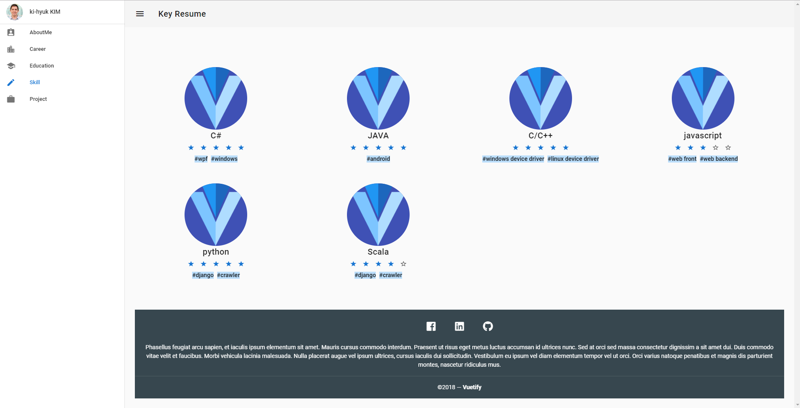
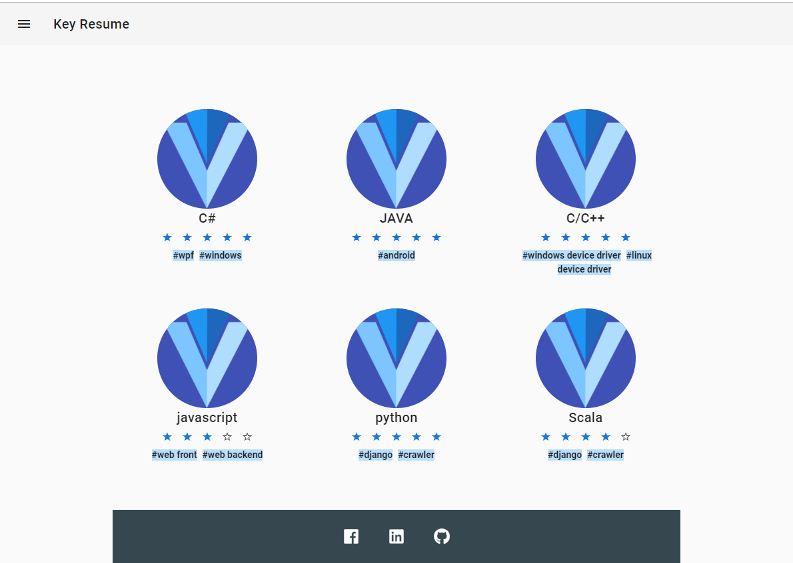
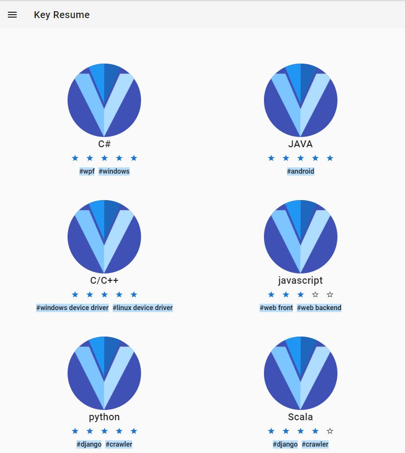
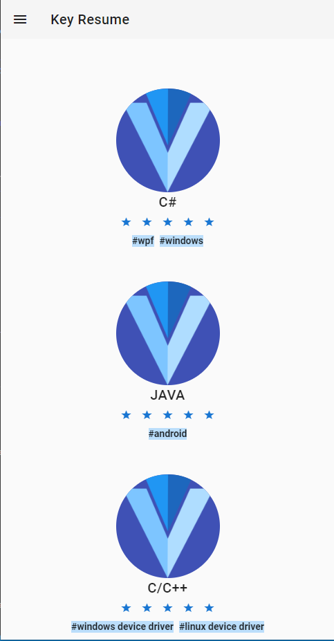

[](https://travis-ci.org/KimKiHyuk/Vuetiful-Resume)

# Vue.js Application for resume frontend 

# libraries
* Vuex for state management
* Nuxt for SEO
* Vuetify for material design

# demo

## Supporting various device environments
* desktop


* tablet


* small tablet


* mobile phone



## Build Setup

``` bash
# install dependencies
$ npm run install

# serve with hot reload at localhost:3000
$ npm run dev

# build for production and launch server
$ npm run build
$ npm run start

# generate static project
$ npm run generate
```

For detailed explanation on how things work, checkout [Nuxt.js docs](https://nuxtjs.org).
